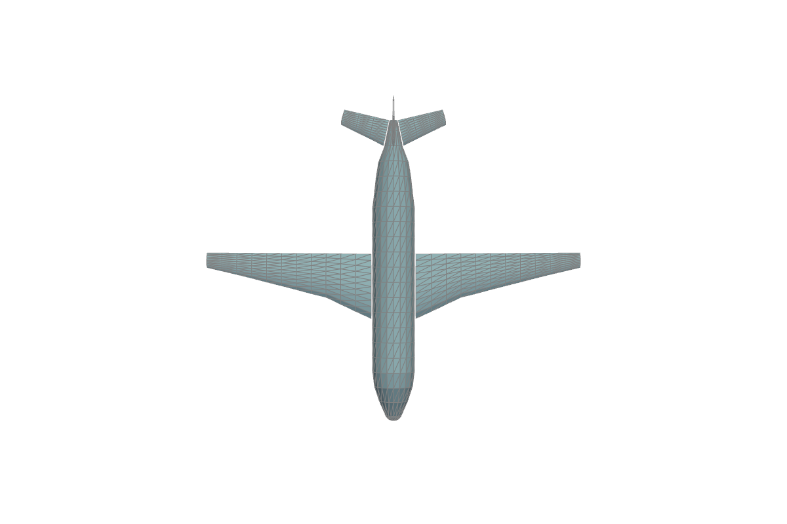
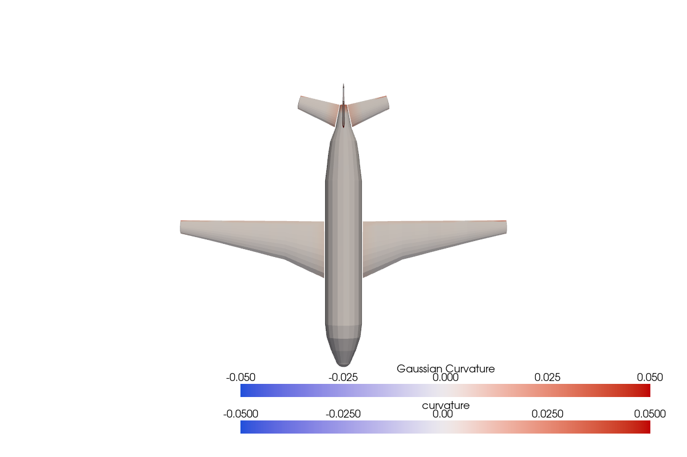

<p align="center">
  
</p>

<p align="center">
  <strong>GPU-Accelerated Mesh Processing for Any Dimension</strong>
</p>

<p align="center">
  <a href="https://www.python.org/downloads/"></a>
  <a href="https://pytorch.org/"></a>
  <a href="LICENSE"></a>
</p>

<p align="center">
  <em>It's not just a bag of triangles -- it's a fast bag of triangles!</em>
</p>

---

## What is TorchMesh?

**The word "mesh" means different things to different communities:**

- **CFD/FEM engineers** think "volume mesh" (3D tetrahedra filling a 3D domain)
- **Graphics programmers** think "surface mesh" (2D triangles in 3D space)
- **Computer vision researchers** think "point cloud" (0D vertices in 3D space)
- **Robotics engineers** think "curves" (1D edges in 2D or 3D space)

**TorchMesh handles all of these** in a unified, dimensionally-generic framework. At its core, TorchMesh operates on **arbitrary-dimensional simplicial complexes embedded in arbitrary-dimensional Euclidean spaces**.

This means you can work with:
- 2D triangles in 2D space (planar meshes for 2D simulations)
- 2D triangles in 3D space (surface meshes for graphics/CFD)
- 3D tetrahedra in 3D space (volume meshes for FEM/CFD)
- 1D edges in 3D space (curve meshes for path planning)
- ...and any other n-dimensional manifold in m-dimensional space (where n ≤ m)

The only restriction: **meshes must be simplicial** (composed of points, line segments, triangles, and tetrahedra). This enables rigorous discrete calculus operators and differential geometry computations.

---

## Key Features

**Core Capabilities:**
- **GPU-Accelerated**: All operations vectorized with PyTorch, run natively on CUDA
- **Dimensionally Generic**: Works with n-D manifolds embedded in m-D spaces
- **TensorDict Integration**: Structured data management with automatic device handling
- **Differentiable**: Seamless integration with PyTorch autograd

**Mathematical Operations:**
- **Discrete Calculus**: Gradient, divergence, curl, Laplace-Beltrami operator
  - Both DEC (Discrete Exterior Calculus) and LSQ (Least-Squares) methods
  - Intrinsic (tangent space) and extrinsic (ambient space) derivatives
- **Differential Geometry**: Gaussian curvature, mean curvature, normals, tangent spaces
- **Curvature Analysis**: Angle defect (intrinsic) and cotangent Laplacian (extrinsic) methods

**Mesh Operations:**
- **Subdivision**: Linear, Loop (C²), and Butterfly (interpolating) schemes
- **Smoothing**: Laplacian smoothing with feature preservation
- **Remeshing**: Uniform remeshing via clustering (dimension-agnostic)
- **Repair**: Remove duplicates, fix orientation, fill holes, clean topology

**Analysis Tools:**
- **Topology**: Boundary detection, watertight/manifold checking
- **Neighbors**: Point-to-point, point-to-cell, cell-to-cell adjacency
- **Quality Metrics**: Aspect ratio, edge lengths, angles, quality scores
- **Spatial Queries**: BVH-accelerated point containment and nearest-cell search

**Production Ready:**
- **Rigorous Testing**: 1600+ passing tests with comprehensive validation
- **No Python Loops**: Fully vectorized operations for maximum performance
- **Type Safe**: Complete type hints and validation

---

## Installation

### Standard Installation

```bash
pip install torchmesh
```

This installs TorchMesh with its core dependencies: PyTorch and TensorDict.

### With I/O and Visualization

```bash
pip install torchmesh[io]
```

This adds PyVista, matplotlib, and numpy for file I/O and visualization. **Note:** PyVista is a **soft dependency** used only for:
- Loading/saving mesh files (STL, OBJ, VTK, PLY, etc.)
- Interactive 3D visualization
- Uniform remeshing (via pyacvd)

All core TorchMesh operations (calculus, curvature, subdivision, etc.) work without PyVista and can stay entirely on GPU.

### From Source

```bash
git clone https://github.com/peterdsharpe/torchmesh.git
cd torchmesh
pip install -e ".[io]"
```

---

## Quick Start

### Creating a Simple Mesh

```python
import torch
from torchmesh import Mesh

# Create a triangle mesh in 2D
points = torch.tensor([
    [0.0, 0.0],
    [1.0, 0.0],
    [0.5, 1.0]
], dtype=torch.float32)

cells = torch.tensor([[0, 1, 2]], dtype=torch.long)

mesh = Mesh(points=points, cells=cells)
print(mesh)
```

**Output:**
```
Mesh(manifold_dim=2, spatial_dim=2, n_points=3, n_cells=1)
    point_data : {}
    cell_data  : {}
    global_data: {}
```

The `__repr__` immediately tells you the dimensional configuration and data structure.

### Adding Data to a Mesh

```python
# Add scalar field at points
mesh.point_data["temperature"] = torch.tensor([300.0, 350.0, 325.0])

# Add scalar field at cells
mesh.cell_data["pressure"] = torch.tensor([101.3])

print(mesh)
```

**Output:**
```
Mesh(manifold_dim=2, spatial_dim=2, n_points=3, n_cells=1)
    point_data : {temperature: ()}
    cell_data  : {pressure: ()}
    global_data: {}
```

### Loading a Real Mesh

```python
from torchmesh.io import from_pyvista
import pyvista as pv

# Load any mesh format PyVista supports
pv_mesh = pv.examples.load_airplane()
mesh = from_pyvista(pv_mesh)

print(mesh)
```

**Output:**
```
Mesh(manifold_dim=2, spatial_dim=3, n_points=1335, n_cells=2452)
    point_data : {}
    cell_data  : {}
    global_data: {}
```

This is a **2D surface mesh** (triangles) embedded in **3D space** - a typical graphics/CAD mesh.

<p align="center">
  
</p>

### Computing Curvature

```python
# Gaussian curvature (intrinsic geometric property)
K = mesh.gaussian_curvature_vertices

print(f"Curvature range: [{K.min():.6f}, {K.max():.6f}]")
# Curvature range: [-0.000795, 8.618090]

# Visualize
mesh.draw(point_scalars=K, cmap="coolwarm")
```

<p align="center">
  
</p>

*Warmer colors indicate positive curvature (convex regions), cooler colors indicate near-zero curvature (flat/saddle regions).*

### Computing Derivatives

```python
# Create scalar field: T = x + 2y
mesh.point_data["temperature"] = mesh.points[:, 0] + 2 * mesh.points[:, 1]

# Compute gradient
mesh_with_grad = mesh.compute_point_derivatives(keys="temperature", method="lsq")
grad_T = mesh_with_grad.point_data["temperature_gradient"]

print(f"Gradient shape: {grad_T.shape}")  # (n_points, n_spatial_dims)
print(f"∇T = {grad_T[0]}")  # tensor([1.0000, 2.0000])
```

### Moving to GPU

```python
# Move entire mesh and all data to GPU
mesh_gpu = mesh.to("cuda")

# Compute on GPU
K_gpu = mesh_gpu.gaussian_curvature_vertices

# Move back to CPU
mesh_cpu = mesh_gpu.to("cpu")
```

---

## Feature Matrix

Comprehensive overview of TorchMesh capabilities:

| Feature | Status | Notes |
|---------|--------|-------|
| **Core Operations** | | |
| Mesh creation & manipulation | ✅ | n-dimensional simplicial meshes |
| Point/cell/global data | ✅ | TensorDict-based |
| GPU acceleration | ✅ | Full CUDA support |
| Merge multiple meshes | ✅ | |
| Device management (CPU/GPU) | ✅ | |
| **Calculus** | | |
| Gradient (LSQ) | ✅ | Weighted least-squares reconstruction |
| Gradient (DEC) | ✅ | Via sharp operator |
| Divergence (LSQ) | ✅ | Component-wise gradients |
| Divergence (DEC) | ✅ | Explicit dual volume formula |
| Curl (LSQ, 3D only) | ✅ | Antisymmetric Jacobian |
| Laplace-Beltrami (DEC) | ✅ | Cotangent weights |
| Intrinsic derivatives | ✅ | Tangent space projection |
| Extrinsic derivatives | ✅ | Ambient space |
| **Geometry** | | |
| Cell centroids | ✅ | Arithmetic mean of vertices |
| Cell areas/volumes | ✅ | Gram determinant method |
| Cell normals | ✅ | Generalized cross product |
| Point normals | ✅ | Area-weighted from adjacent cells |
| Facet extraction | ✅ | Extract (n-1)-dimensional simplices |
| Boundary detection | ✅ | |
| **Curvature** | | |
| Gaussian curvature (vertices) | ✅ | Angle defect method |
| Gaussian curvature (cells) | ✅ | |
| Mean curvature | ✅ | Cotangent Laplacian method |
| **Subdivision** | | |
| Linear | ✅ | Midpoint subdivision |
| Loop | ✅ | C² smooth, approximating |
| Butterfly | ✅ | Interpolating |
| **Smoothing** | | |
| Laplacian smoothing | ✅ | |
| **Remeshing** | | |
| Uniform remeshing | ✅ | Clustering-based (ACVD) |
| **Spatial Queries** | | |
| BVH construction | ✅ | |
| Point containment | ✅ | BVH-accelerated |
| Nearest cell search | ✅ | |
| Data interpolation | ✅ | Barycentric coordinates |
| **Sampling** | | |
| Random points on cells | ✅ | Dirichlet distribution |
| Data sampling at points | ✅ | |
| **Transformations** | | |
| Translation | ✅ | |
| Rotation | ✅ | Arbitrary axis |
| Scaling | ✅ | Uniform or anisotropic |
| Arbitrary matrix transform | ✅ | |
| Extrusion | ✅ | Manifold → higher dimension |
| **Neighbors & Adjacency** | | |
| Point-to-points | ✅ | Graph edges |
| Point-to-cells | ✅ | Vertex star |
| Cell-to-cells | ✅ | Shared facets |
| Cells-to-points | ✅ | Cell vertices |
| Ragged array format | ✅ | Efficient offset-indices encoding |
| **Topology & Repair** | | |
| Watertight detection | ✅ | |
| Manifold detection | ✅ | |
| Remove duplicate vertices | ✅ | |
| Remove duplicate cells | ✅ | |
| Remove degenerate cells | ✅ | |
| Remove isolated vertices | ✅ | |
| Fix orientation | ✅ | |
| Fill holes | ✅ | |
| Clean mesh (all-in-one) | ✅ | |
| **Validation & Analysis** | | |
| Quality metrics | ✅ | Aspect ratio, angles, edge ratios |
| Mesh statistics | ✅ | |
| **I/O** | | |
| PyVista integration | ✅ | All PyVista-supported formats |
| Direct STL/OBJ/HDF5 | ❌ | Use PyVista for these |
| **Visualization** | | |
| Matplotlib backend | ✅ | 2D/3D plotting |
| PyVista backend | ✅ | Interactive 3D |
| Scalar colormapping | ✅ | Auto L2-norm for vectors |
| Nested TensorDict keys | ✅ | |

**Legend:** ✅ Complete | ❌ Not Implemented

---

## Examples

### Discrete Calculus

```python
from torchmesh.io import from_pyvista
import pyvista as pv

# Load a mesh
mesh = from_pyvista(pv.examples.load_tetbeam())

# Add scalar field: pressure
mesh.point_data["pressure"] = (mesh.points ** 2).sum(dim=-1)

# Compute gradient
mesh_with_grad = mesh.compute_point_derivatives(keys="pressure", method="lsq")
grad_p = mesh_with_grad.point_data["pressure_gradient"]
# Shape: (n_points, 3)

# Compute divergence
from torchmesh.calculus import compute_divergence_points_lsq

mesh.point_data["velocity"] = mesh.points.clone()
div_v = compute_divergence_points_lsq(mesh, mesh.point_data["velocity"])
# Expected: ≈3.0 for v = r

# Compute curl (3D only)
from torchmesh.calculus import compute_curl_points_lsq

curl_v = compute_curl_points_lsq(mesh, mesh.point_data["velocity"])

# Compute Laplace-Beltrami operator
from torchmesh.calculus import compute_laplacian_points_dec

laplacian_p = compute_laplacian_points_dec(mesh, mesh.point_data["pressure"])
```

### Intrinsic vs Extrinsic Derivatives

For surfaces embedded in 3D, you can compute derivatives in the tangent space (intrinsic) or ambient space (extrinsic):

```python
# Load a surface mesh (2D in 3D)
mesh = from_pyvista(pv.examples.load_airplane())
mesh.point_data["temperature"] = (mesh.points ** 2).sum(dim=-1)

# Intrinsic gradient (lives in tangent plane)
mesh_intrinsic = mesh.compute_point_derivatives(
    keys="temperature",
    method="lsq",
    gradient_type="intrinsic"
)
grad_intrinsic = mesh_intrinsic.point_data["temperature_gradient"]
# Orthogonal to surface normal

# Extrinsic gradient (lives in 3D ambient space)
mesh_extrinsic = mesh.compute_point_derivatives(
    keys="temperature",
    method="lsq",
    gradient_type="extrinsic"
)
grad_extrinsic = mesh_extrinsic.point_data["temperature_gradient"]
# Full 3D vector
```

### Mesh Subdivision

```python
# Linear subdivision (simplest)
refined = mesh.subdivide(levels=2, filter="linear")

# Loop subdivision (smooth, C²)
smooth = mesh.subdivide(levels=2, filter="loop")

# Butterfly subdivision (interpolating)
interp = mesh.subdivide(levels=2, filter="butterfly")
```

### Boundary Extraction and Topology

```python
# Extract boundary mesh
boundary = mesh.get_boundary_mesh()

# Check topology
is_watertight = mesh.is_watertight()
is_manifold = mesh.is_manifold()

# Extract facets (edges from triangles, faces from tets)
facet_mesh = mesh.get_facet_mesh()
```

### Spatial Queries

```python
from torchmesh.spatial import BVH

# Build acceleration structure
bvh = BVH.from_mesh(mesh)

# Find which cells contain query points
query_points = torch.rand(1000, 3)
cell_candidates = bvh.find_candidate_cells(query_points)

# Sample data at arbitrary points
sampled_data = mesh.sample_data_at_points(
    query_points,
    data_source="points",  # or "cells"
)
```

### Neighbor and Adjacency Structures

```python
# Point-to-points adjacency (graph edges)
adj = mesh.get_point_to_points_adjacency()
neighbors = adj.to_list()  # List of neighbors for each point

# Cell-to-cells adjacency (cells sharing facets)
cell_adj = mesh.get_cell_to_cells_adjacency(adjacency_codimension=1)
cell_neighbors = cell_adj.to_list()

# All adjacency types use efficient ragged array format
print(f"Total edges: {adj.n_total_neighbors // 2}")
```

### Mesh Repair and Cleaning

```python
# Clean mesh (all-in-one)
clean_mesh = mesh.clean(
    merge_points=True,
    remove_duplicate_cells=True,
    remove_unused_points=True,
)

# Or use individual operations
from torchmesh.repair import (
    remove_duplicate_vertices,
    remove_degenerate_cells,
    fix_orientation,
    fill_holes,
)

mesh = remove_duplicate_vertices(mesh)
mesh = remove_degenerate_cells(mesh)
mesh = fix_orientation(mesh)
mesh = fill_holes(mesh)
```

### Transformations

```python
# Translate
mesh_translated = mesh.translate([1.0, 0.0, 0.0])

# Rotate (3D)
import numpy as np
mesh_rotated = mesh.rotate(axis=[0, 0, 1], angle=np.pi/4)

# Scale
mesh_scaled = mesh.scale(2.0)  # Uniform
mesh_scaled_aniso = mesh.scale([2.0, 1.0, 0.5])  # Anisotropic

# Arbitrary transformation matrix
matrix = torch.eye(3)
mesh_transformed = mesh.transform(matrix)
```

---

## Core Concepts

### Mesh Data Structure

The `Mesh` class is a `tensorclass` (from PyTorch's TensorDict library) with five core components:

```python
@tensorclass
class Mesh:
    points: torch.Tensor          # Shape: (n_points, n_spatial_dims)
    cells: torch.Tensor           # Shape: (n_cells, n_manifold_dims + 1), dtype: int
    point_data: TensorDict        # Per-vertex data
    cell_data: TensorDict         # Per-cell data  
    global_data: TensorDict       # Mesh-level data
```

All data moves together when you call `.to("cuda")` or `.to("cpu")`.

### Dimensional Terminology

- **`n_spatial_dims`**: Dimension of the embedding space (2 for 2D, 3 for 3D, etc.)
- **`n_manifold_dims`**: Dimension of the mesh manifold itself
  - 0 for point clouds
  - 1 for curves/polylines
  - 2 for surfaces/shells
  - 3 for volumes
- **`codimension`**: `n_spatial_dims - n_manifold_dims`
  - Codimension-0: Volume meshes (manifold fills the space)
  - Codimension-1: Surface meshes (normals are well-defined)
  - Codimension-2+: Curves and point clouds (no unique normal direction)

Examples:
- Triangles in 2D: `n_spatial_dims=2`, `n_manifold_dims=2`, `codimension=0`
- Triangles in 3D: `n_spatial_dims=3`, `n_manifold_dims=2`, `codimension=1`
- Edges in 3D: `n_spatial_dims=3`, `n_manifold_dims=1`, `codimension=2`
- Tetrahedra in 3D: `n_spatial_dims=3`, `n_manifold_dims=3`, `codimension=0`

### Cached Properties

Expensive computations are automatically cached:

```python
# First access computes and caches
centroids = mesh.cell_centroids  # Cached in mesh.cell_data["_centroids"]
areas = mesh.cell_areas          # Cached in mesh.cell_data["_areas"]
normals = mesh.cell_normals      # Cached in mesh.cell_data["_normals"]

# Subsequent accesses are free (retrieves from cache)
centroids_again = mesh.cell_centroids  # Fast lookup
```

Properties starting with `_` in data dictionaries are cache entries.

### TensorDict for Complex Data

TensorDict enables hierarchical data structures:

```python
from tensordict import TensorDict

# Nested data
mesh.point_data["flow"] = TensorDict({
    "velocity": torch.randn(mesh.n_points, 3),
    "pressure": torch.randn(mesh.n_points),
    "temperature": torch.randn(mesh.n_points),
}, batch_size=[mesh.n_points])

# Access with tuple keys
mesh.draw(point_scalars=("flow", "temperature"))
```

---

## Philosophy & Design

TorchMesh is built on three principles:

1. **Correctness First**: Rigorous mathematical foundations, extensive validation
2. **Performance Second**: Fully vectorized GPU operations, no Python loops over mesh elements
3. **Usability Third**: Clean APIs that don't sacrifice power for simplicity

**Key Design Decisions:**

- **Simplicial Meshes Only**: Restricting to simplices (vs general polygons/polyhedra) enables rigorous discrete exterior calculus operators with solid mathematical foundations.

- **TensorDict for Data**: Structured data management with automatic batching, device movement, and hierarchical organization. All data structures move together as a unit.

- **Explicit Dimensionality**: `n_spatial_dims` and `n_manifold_dims` are first-class concepts, enabling truly dimension-agnostic algorithms.

- **Cached Properties**: Expensive computations (normals, curvature, dual volumes) are computed once and cached automatically.

- **Fail Loudly**: Validation catches errors early with helpful messages. No silent failures or NaN propagation.

---

## Documentation & Resources

- **Examples**: See [`examples/`](examples/) for runnable demonstrations
- **Tests**: See [`test/`](test/) for comprehensive test suite (1600+ tests)
- **Source**: Explore [`src/torchmesh/`](src/torchmesh/) for implementation details

**Module Organization:**
- `torchmesh.calculus` - Discrete differential operators
- `torchmesh.curvature` - Gaussian and mean curvature
- `torchmesh.subdivision` - Mesh refinement schemes
- `torchmesh.boundaries` - Boundary detection and facet extraction
- `torchmesh.neighbors` - Adjacency computations
- `torchmesh.spatial` - BVH and spatial queries
- `torchmesh.sampling` - Point sampling and interpolation
- `torchmesh.transformations` - Geometric operations
- `torchmesh.repair` - Mesh cleaning and topology repair
- `torchmesh.validation` - Quality metrics and statistics
- `torchmesh.visualization` - Matplotlib and PyVista backends
- `torchmesh.io` - PyVista import/export
- `torchmesh.examples` - Example mesh generators

---

## Citation

If you use TorchMesh in your research, please cite:

```bibtex
@software{torchmesh2025,
  author = {Sharpe, Peter},
  title = {TorchMesh: GPU-Accelerated Mesh Processing for Scientific Computing},
  year = {2025},
  url = {https://github.com/peterdsharpe/torchmesh},
  version = {0.1.0}
}
```

---

## License

TorchMesh is licensed under the Apache License 2.0. See [LICENSE](LICENSE) for details.

---

## Acknowledgments

TorchMesh builds on decades of research in discrete differential geometry and computational geometry:

- **Discrete Exterior Calculus**: Desbrun, Hirani, Leok, Marsden (2005) - [arXiv:math/0508341](https://arxiv.org/abs/math/0508341)
- **Discrete Differential Operators**: Meyer, Desbrun, Schröder, Barr (2003)
- **Loop Subdivision**: Loop (1987)
- **Butterfly Subdivision**: Dyn, Levin, Gregory (1990)

**Special thanks to:**
- **[PyTorch](https://pytorch.org/)** team for the foundational deep learning framework
- **[PyVista](https://pyvista.org/)** team for the excellent 3D visualization and I/O library
- The discrete differential geometry community for rigorous mathematical foundations

---

**Questions? Issues? Feature requests?**  
Open an issue on [GitHub](https://github.com/peterdsharpe/torchmesh/issues)!
