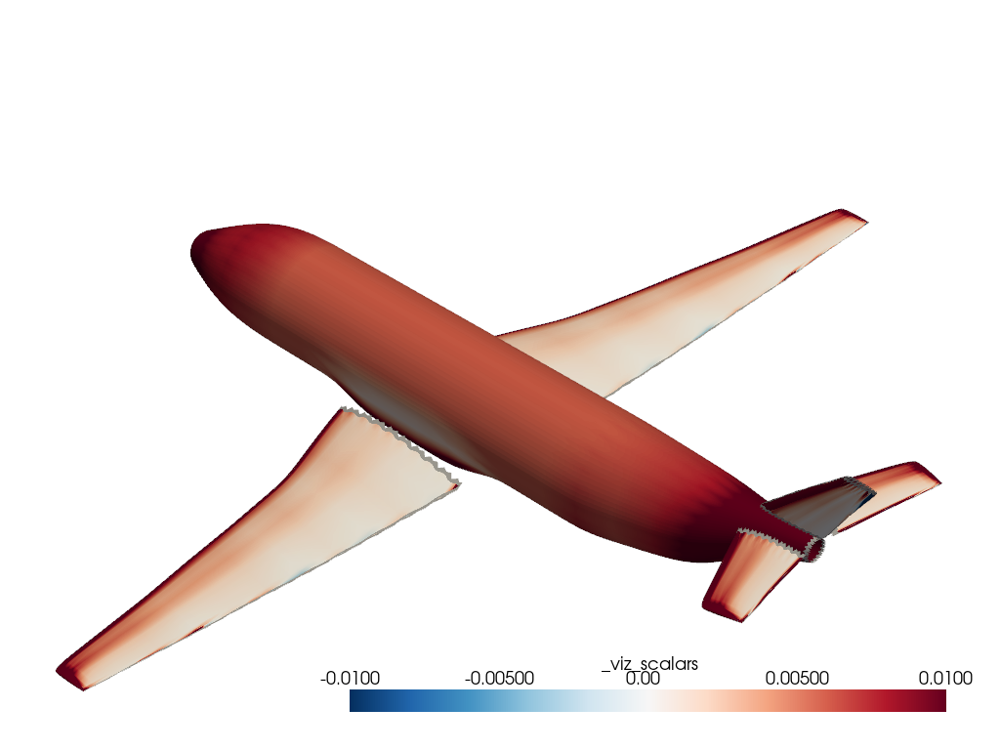

# Summary

In scientific computing, computer graphics, and engineering simulation, the term "mesh" means different things to different communities: computational fluid dynamics (CFD) and finite element method (FEM) engineers work with volume meshes (3D tetrahedra filling a domain), graphics programmers manipulate surface meshes (2D triangles in 3D space), computer vision researchers process point clouds (0D vertices), and robotics engineers plan paths on curve meshes (1D edges). TorchMesh unifies these diverse concepts by operating on arbitrary-dimensional pure simplicial complexes embedded in arbitrary-dimensional space, all through a single, consistent application programming interface (API). Built on PyTorch [@pytorch], TorchMesh provides end-to-end GPU acceleration, automatic differentiation support, and rigorous mathematical foundations based on discrete exterior calculus [@hirani2003discrete; @desbrun2005discrete]. The library enables researchers to seamlessly move mesh operations to GPU, compute gradients through mesh processing pipelines, and work with meshes of any dimensionality using the same code. This dimensional genericity, combined with GPU acceleration and differentiability, distinguishes TorchMesh from existing mesh processing libraries and enables new research directions in physics-informed machine learning, differentiable rendering, and large-scale scientific simulation.

# Statement of Need

Mesh processing is fundamental to scientific computing, computer graphics, and engineering simulation. However, existing libraries exhibit a fundamental tradeoff: tools offering rich functionality typically lack GPU acceleration and differentiability (PyVista [@sullivan2019pyvista], trimesh [@trimesh]), while GPU-accelerated differentiable alternatives focus exclusively on graphics applications with 2D surfaces in 3D space (PyTorch3D [@ravi2020pytorch3d], Kaolin [@kaolin]). No existing tool combines GPU acceleration, dimensional genericity, and automatic differentiation in a unified framework.

PyVista provides an excellent API for mesh manipulation and visualization, but operates exclusively on CPU, lacks support for automatic differentiation, and does not generalize beyond 3D spatial embeddings. For researchers working with large-scale simulations or gradient-based optimization, this CPU-only limitation creates a significant bottleneck. PyTorch3D and Kaolin offer GPU acceleration and differentiability, making them valuable for computer graphics and 3D deep learning, but both are designed specifically for surface meshes in 3D space. They cannot represent 1D curve meshes for path planning, 2D planar meshes for 2D simulations, or 3D tetrahedral volume meshes for FEM/CFD applications. Moreover, neither library implements discrete exterior calculus or provides intrinsic differential operators on manifolds.

TorchMesh fills this gap by providing a dimensionally-generic mesh processing library that operates on n-dimensional manifolds embedded in m-dimensional spaces (where $n \leq m$), with full GPU acceleration via PyTorch and seamless integration with automatic differentiation. The library implements rigorous discrete exterior calculus [@hirani2003discrete; @desbrun2005discrete] and discrete differential geometry [@meyer2003discrete], enabling computation of gradients, divergence, curl, and curvature on arbitrary-dimensional manifolds. Crucially, TorchMesh distinguishes between intrinsic (tangent space) and extrinsic (ambient space) differential operators, allowing researchers to compute derivatives along the manifold or in the embedding space as needed.

The restriction to simplicial meshes (i.e., composed exclusively of points, line segments, triangles, tetrahedra, and higher-dimensional simplices) enables rigorous mathematical foundations while maintaining computational efficiency. This design choice allows TorchMesh to implement well-established algorithms from discrete exterior calculus and computational geometry without the ambiguities that arise in mixed-element or polyhedral meshes.

TorchMesh serves multiple research communities: CFD/FEM engineers solving partial differential equations on complex domains, graphics researchers developing differentiable rendering pipelines, machine learning practitioners working with geometric deep learning, and robotics researchers planning paths on manifolds. The library's differentiability enables gradient-based optimization over mesh geometries, making it particularly valuable for inverse problems, shape optimization, and physics-informed neural networks. Its GPU acceleration allows processing of meshes with millions of elements at interactive speeds.

Beyond basic mesh operations, TorchMesh provides sophisticated features including multiple subdivision schemes (linear, Loop [@loop1987smooth], and Butterfly [@zorin1996interpolating]), Laplacian smoothing, mesh repair operations, and bounding volume hierarchy (BVH)-accelerated spatial queries. All operations are fully vectorized with no Python loops over mesh elements, ensuring maximum performance on modern GPU hardware.

# Key Features

TorchMesh implements a comprehensive suite of mesh processing capabilities:

**Discrete Calculus:** Gradient and Jacobian computation via least-squares reconstruction and discrete exterior calculus, divergence operators for both methods, curl for 3D manifolds, and intrinsic versus extrinsic derivative modes for manifold-aware computation.

**Differential Geometry:** Gaussian curvature computation via angle defect method (see \autoref{fig:gaussian}), mean curvature via cotangent Laplacian (see \autoref{fig:mean}), cell and point normals, and tangent space computation.

**Mesh Operations:** Linear, Loop (C² smooth), and Butterfly (interpolating) subdivision schemes; Laplacian smoothing; uniform remeshing via clustering; and comprehensive repair operations (duplicate removal, orientation fixing, hole filling).

**Spatial Queries:** BVH construction and queries for point containment and nearest-cell search, with barycentric coordinate interpolation for data sampling.

**Data Management:** Integration with TensorDict [@tensordict] for structured per-vertex, per-cell, and global data storage with automatic device handling, supporting arbitrary-rank tensor fields including scalars, vectors, and higher-order tensors.

{ width=80% }

{ width=80% }

# Acknowledgements

The mathematical foundations of TorchMesh draw heavily from Hirani's seminal work on discrete exterior calculus [@hirani2003discrete; @desbrun2005discrete] and Meyer et al.'s discrete differential geometry operators [@meyer2003discrete]. The API design takes inspiration from PyVista's user-friendly interface [@sullivan2019pyvista]. The implementation builds upon the PyTorch deep learning framework [@pytorch] and TensorDict library [@tensordict].

# References

